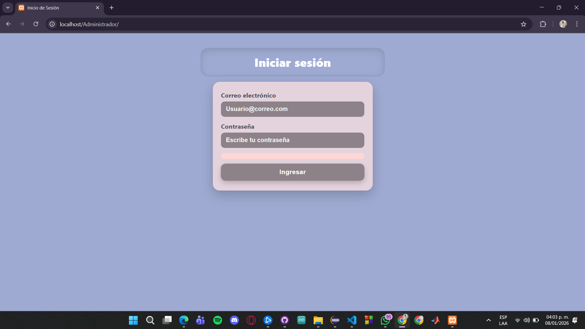
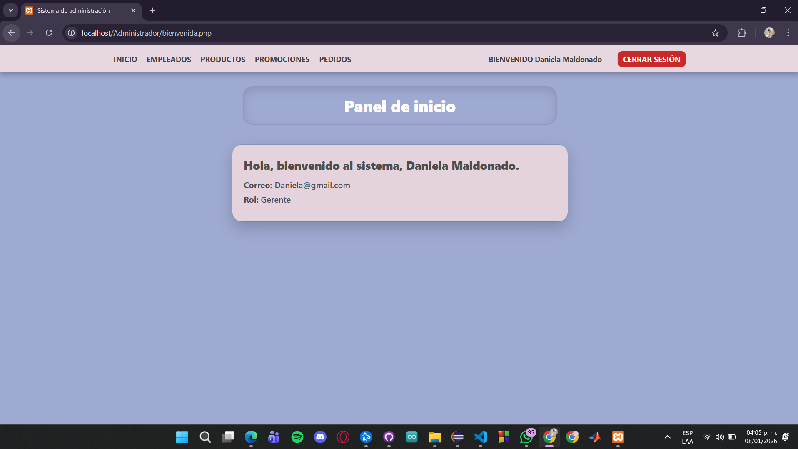
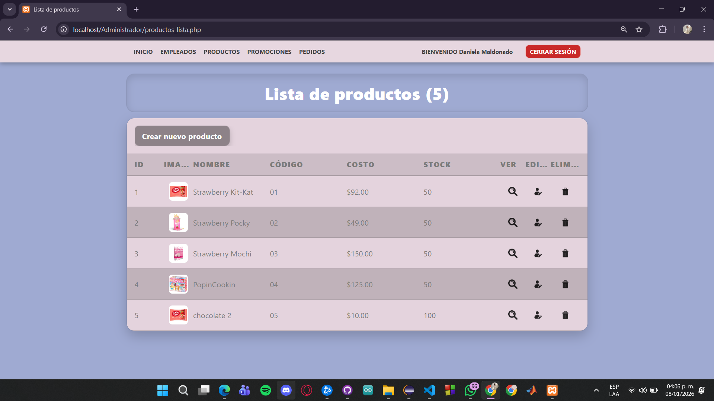

# Sistema de Administración Web

Proyecto académico desarrollado en PHP para la gestión de empleados y productos mediante un panel administrativo.

## 🛠 Tecnologías
- PHP
- MySQL
- HTML
- CSS
- JavaScript
- XAMPP

## 🚀 Cómo ejecutar el proyecto
1. Descargar o clonar el repositorio
2. Copiar la carpeta del proyecto en `xampp/htdocs`
3. Abrir phpMyAdmin
4. Crear una base de datos llamada `empresa`
5. Importar el archivo `database/empresa.sql`
6. Configurar la conexión a la base de datos
7. Iniciar Apache y MySQL
8. Abrir en el navegador `http://localhost/`

## ✨ Funcionalidades
- Login de administrador
- Gestión de empleados
- Gestión de productos

## 📸 Capturas del sistema

### Login

### Panel principal

### Lista de empleados

### Alta de empleados

### Lista de Productos

### Alta de productos

## 📌 Notas
Este proyecto se ejecuta en entorno local utilizando XAMPP. El repositorio contiene únicamente el código fuente y el script de base de datos :D.
